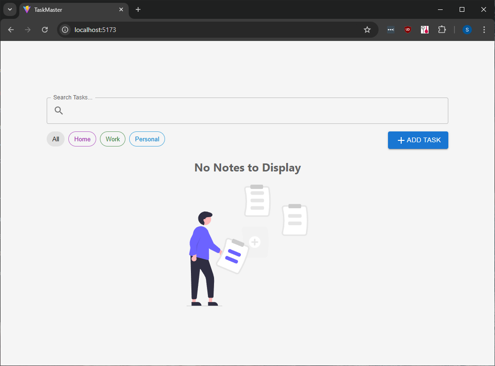
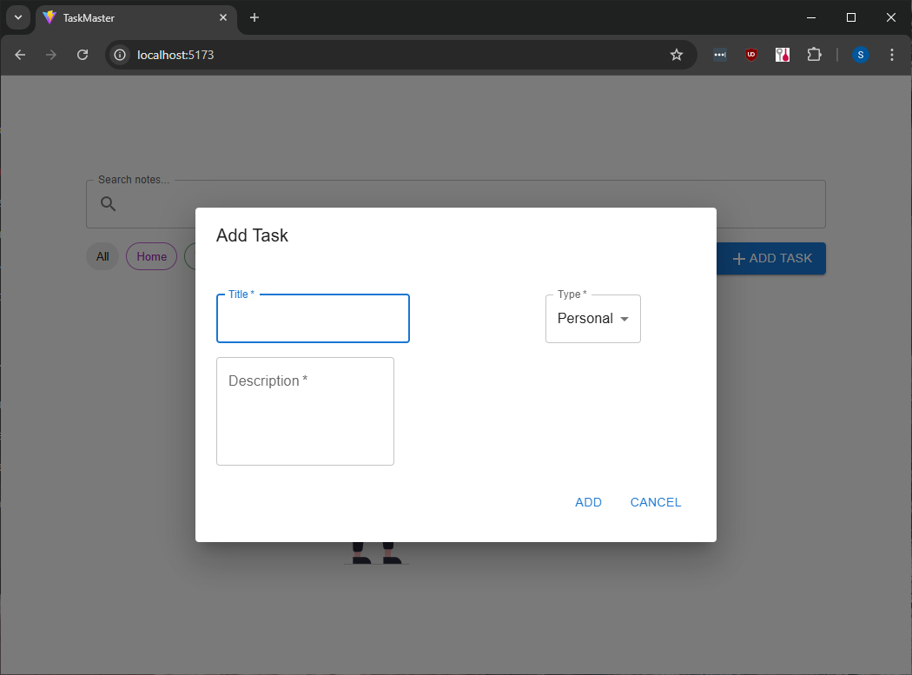
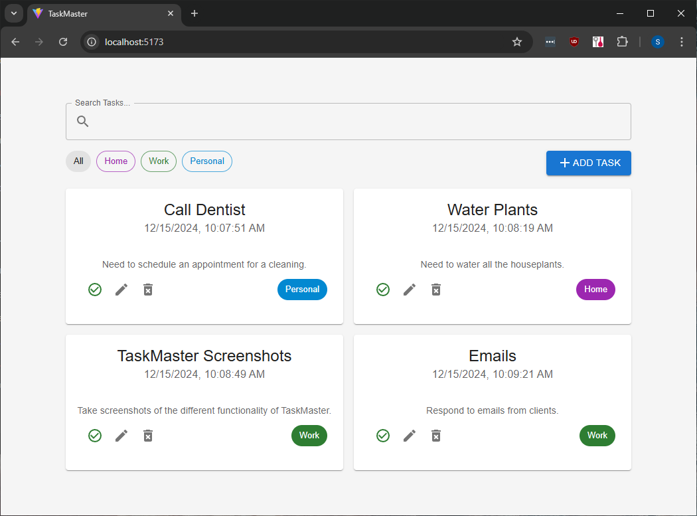
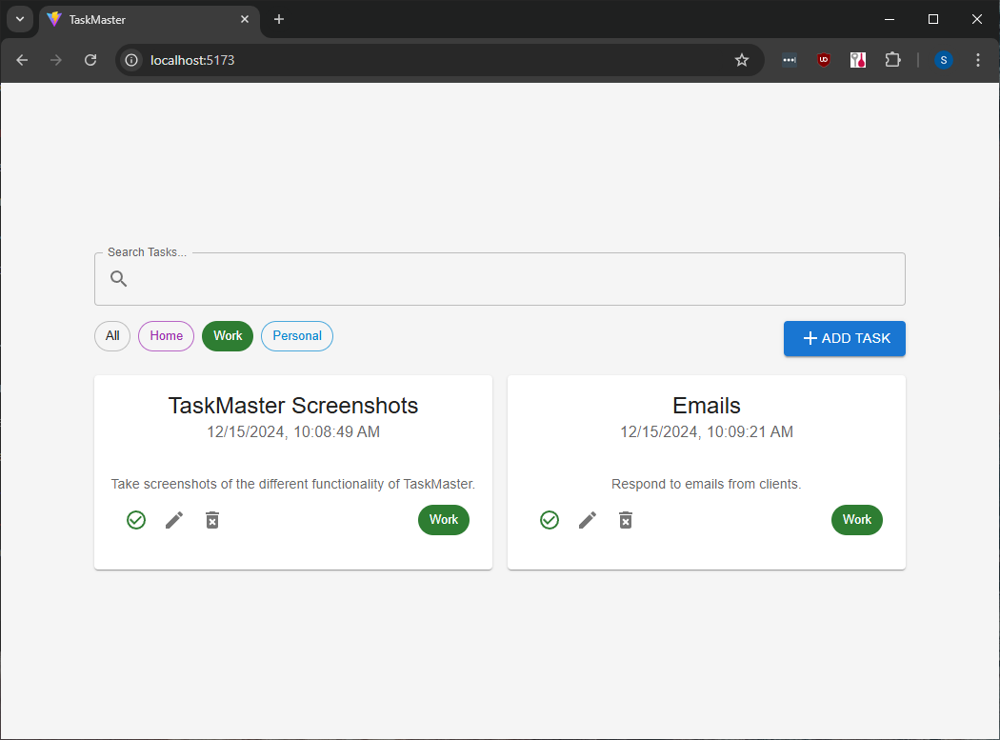
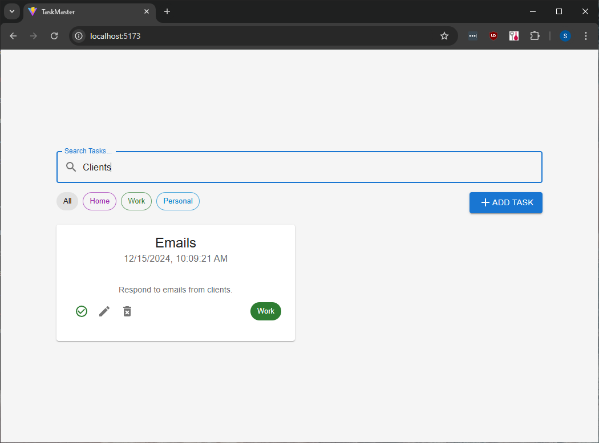
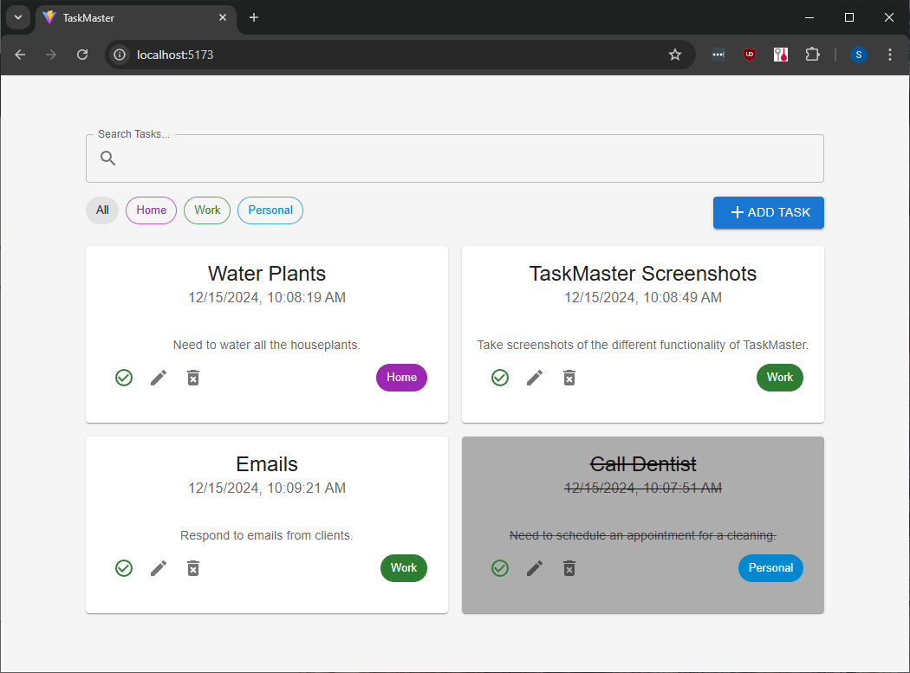

# TaskMaster

TaskMaster is a Vite + React web application for keeping track of tasks, whether they're personal, for around the house, or for work. The application makes use of localStorage for task storage, keeping your task information stored entirely on your own machine.
The user of TaskMaster can add tasks, delete tasks, and mark tasks as complete. Filtering and search functionality are available to the user.

## Installation

1. Fork and clone this repository
2. Navigate to the local directory with `cd notes`
3. Make sure you have Node.js installed with a version greater than 18.0.0
4. Install the necessary packages with `npm install`
5. Start the application with `npm run dev`, open the localhost version in a browser

## Functionality

### Default View

### Add Task View

### Default View with Tasks

### Filtered Task View

### Search Results View

### Default View with Completed Task

## Roadmap

- [ ] Add functionality for the user to edit tasks.
- [ ] Adjust Add Task form layout
- [ ] Add CSS animations to smooth out functionality such as marking a task complete.

## Contributions

Contributions are welcome! Please fork the repository and create a new branch for your features or bug fixes. Submit a pull request describing your changes.
